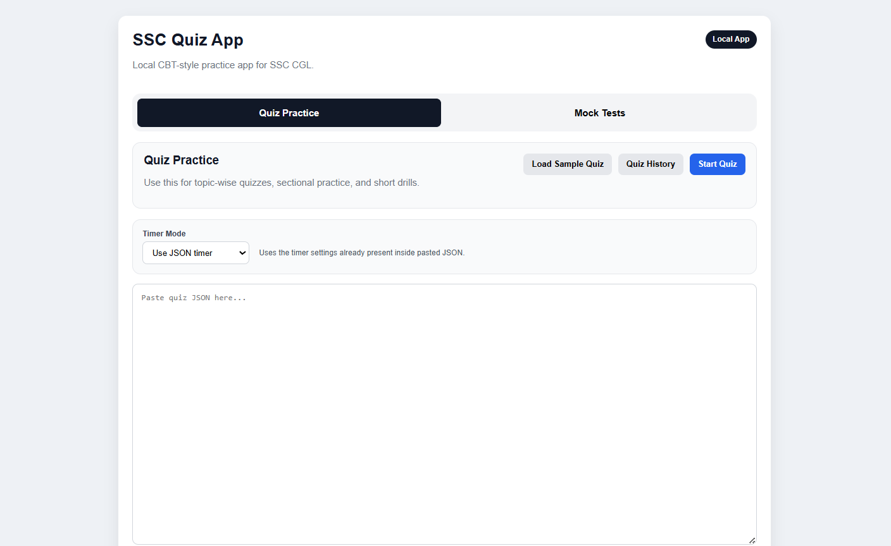
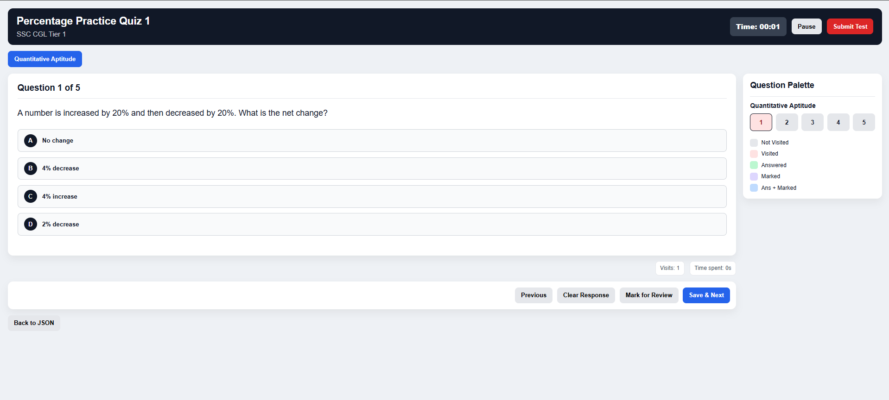
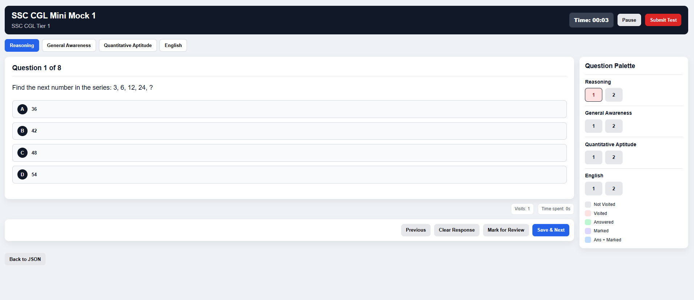
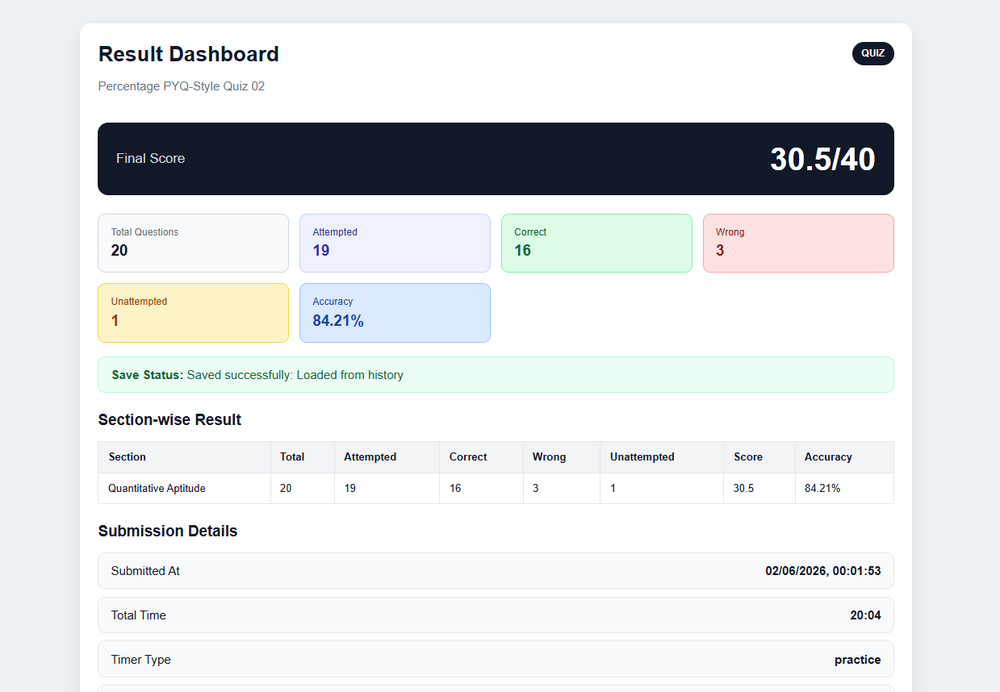
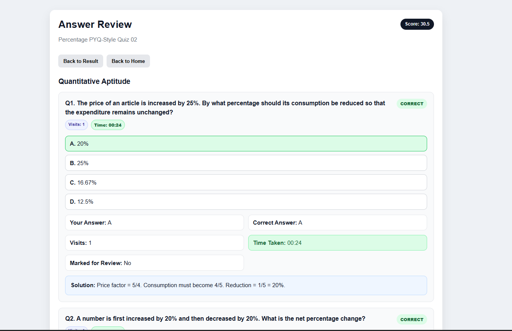

# SSC CGL Quiz & Mock Practice App

A local-first CBT-style quiz/mock practice app built for SSC CGL preparation.

This app lets you paste ChatGPT-generated quiz/mock JSON, attempt tests like a computer-based exam, submit them, review answers, track time, and save/export attempt data locally.

No login. No cloud database. No paid services.

---

## App Preview

### Home Screen



The home screen separates the app into:

- Quiz Practice
- Mock Tests

You can paste JSON, load sample tests, select timer mode, and open saved history.

---

### Quiz Practice Mode



Quiz mode is useful for:

- Topic-wise practice
- Short drills
- Sectional practice
- Speed improvement

Features include:

- Question navigation
- Save & Next
- Clear response
- Mark for review
- Timer
- Pause/resume
- Per-question time tracking
- Visit tracking

---

### Mock Test Mode



Mock mode supports SSC-style sectional testing.

For sectional mock tests:

- Each section has its own timer
- Future sections remain locked
- Completed sections are locked permanently
- User can submit a section early
- Section auto-submits when time ends
- Final result is shown after the last section

Recommended SSC CGL structure:

```txt
Reasoning - 25 questions
General Awareness - 25 questions
Quantitative Aptitude - 25 questions
English Comprehension - 25 questions
```

---

### Result Dashboard



After submission, the dashboard shows:

- Final score / maximum marks
- Total questions
- Attempted
- Correct
- Wrong
- Unattempted
- Accuracy
- Section-wise result
- Section timing
- Pause count
- Total paused time

Useful buttons:

- Review Answers
- Copy Analysis JSON
- Copy Submission JSON

`Copy Analysis JSON` is best for sending your full attempt data to ChatGPT for deeper analysis.

---

### Answer Review



The review screen shows:

- Question
- Selected answer
- Correct answer
- Solution
- Correct/wrong/unattempted status
- Visits per question
- Time taken per question
- Marked for review status

Time taken is color-coded:

```txt
Green  = fast
Yellow = moderate
Red    = slow
```

This helps quickly identify slow or confusing questions.

---

## Main Features

```txt
Paste ChatGPT-generated JSON
Attempt quiz/mock in CBT-style UI
Quiz mode and mock mode separated
Practice timer / strict timer / no timer
Sectional timer for mock tests
Pause and resume test
Track per-question time
Track question visits
Mark questions for review
Submit and calculate score
Review answers with solutions
Save attempts locally
View history separately for quiz/mock
Filter history by date/date range
Export individual attempts
Export filtered history data
Delete attempts
Copy result JSON for ChatGPT analysis
```

---

## Tech Stack

```txt
Frontend: React + Vite
Backend: Node.js + Express
Storage: Local JSON files
Database: None
Cloud: None
```

---

## Project Structure

```txt
ssc-quiz-app/
├── client/
│   └── src/
│       ├── components/
│       ├── utils/
│       ├── sample-data/
│       ├── App.jsx
│       └── styles.css
│
├── server/
│   ├── routes/
│   ├── utils/
│   ├── data/
│   │   ├── quiz-attempts/
│   │   └── mock-attempts/
│   └── server.js
│
├── Images/
│   ├── Home.png
│   ├── Quiz.png
│   ├── Mock.png
│   ├── Dashboard.png
│   └── Review.png
│
├── JSON_PROMPTS.md
├── README.md
└── package.json
```

---

## Local Attempt Storage

Attempts are saved locally in:

```txt
server/data/
├── quiz-attempts/
└── mock-attempts/
```

Each attempt folder contains:

```txt
questions.json
submission.json
summary.json
```

These files are ignored by Git so your personal test history is not uploaded.

---

## JSON Input Format

The app accepts JSON generated by ChatGPT.

Example quiz structure:

```json
{
  "testId": "percentage-practice-quiz-01",
  "testName": "Percentage Practice Quiz 01",
  "mode": "quiz",
  "exam": "SSC CGL Tier 1",
  "timer": {
    "type": "practice",
    "mode": "test",
    "durationMinutes": 10
  },
  "marking": {
    "correct": 2,
    "wrong": -0.5,
    "unattempted": 0
  },
  "sections": [
    {
      "sectionId": "quant",
      "sectionName": "Quantitative Aptitude",
      "questions": [
        {
          "questionId": "q1",
          "questionText": "A number is increased by 20% and then decreased by 20%. What is the net change?",
          "options": [
            { "id": "A", "text": "No change" },
            { "id": "B", "text": "4% increase" },
            { "id": "C", "text": "4% decrease" },
            { "id": "D", "text": "2% decrease" }
          ],
          "correctOptionId": "C",
          "solution": "Successive change = 20 - 20 - 4 = -4%, so 4% decrease."
        }
      ]
    }
  ]
}
```

---

## Timer Modes

### Timer Type

```txt
none     → no timer
practice → count-up timer
strict   → countdown timer with auto-submit
```

### Timer Scope

```txt
test       → one timer for full test
sectional  → separate timer per section
```

Example sectional mock timer:

```json
"timer": {
  "type": "strict",
  "mode": "sectional",
  "durationMinutes": 15
}
```

This gives each mock section 15 minutes.

---

## Installation

### 1. Clone the repository

```bash
git clone https://github.com/vaivaswatmanu/ssc-cgl-quiz-app.git
```

### 2. Open project folder

```bash
cd ssc-cgl-quiz-app
```

### 3. Install root dependencies

```bash
npm install
```

### 4. Install backend dependencies

```bash
cd server
npm install
```

### 5. Install frontend dependencies

```bash
cd ../client
npm install
```

### 6. Go back to root

```bash
cd ..
```

### 7. Start the app

```bash
npm run dev
```

Frontend:

```txt
http://localhost:5173
```

Backend:

```txt
http://localhost:5000
```

---

## Daily Usage

### Quiz Practice

```txt
1. Open app
2. Select Quiz Practice
3. Paste quiz JSON
4. Choose timer mode
5. Start quiz
6. Submit
7. Review answers
8. Copy Analysis JSON for ChatGPT analysis
```

### Mock Test

```txt
1. Open app
2. Select Mock Tests
3. Paste mock JSON
4. Use strict sectional timer
5. Attempt section by section
6. Submit/review
7. Export or copy result JSON
```

---

## Suggested ChatGPT Prompt for Quiz JSON

```txt
Generate app-compatible JSON quiz.

Mode: quiz
Topic: Percentage
Questions: 11
Difficulty: SSC CGL Tier 1
Question style: PYQ-style
Test name: Percentage Practice Quiz 01

Timer:
- type: practice
- mode: test
- durationMinutes: 6.6

Rules:
- Every question must have exactly 4 options: A, B, C, D.
- Every question must have exactly one clearly correct answer.
- correctOptionId must match one option id.
- Include concise solution for each question.
- Return only valid JSON inside a single JSON code block.
```

---

## Suggested ChatGPT Prompt for Mock JSON

```txt
Generate app-compatible JSON full mock.

Mode: mock
Exam: SSC CGL Tier 1
Sections:
- Reasoning: 25 questions
- General Awareness: 25 questions
- Quantitative Aptitude: 25 questions
- English Comprehension: 25 questions

Timer:
- type: strict
- mode: sectional
- durationMinutes: 15

Question style: PYQ-style
Test name: SSC CGL Full Mock 01

Rules:
- Every question must have exactly 4 options: A, B, C, D.
- Every question must have exactly one clearly correct answer.
- Do not include faulty questions.
- Do not include questions where no option is valid.
- correctOptionId must match one option id.
- Include concise solution for each question.
- Return only valid JSON inside a single JSON code block.
```

---

## Current Limitations

```txt
No cloud sync
No login
No database
No mobile app
No PDF extraction
No automatic PYQ import
```

These are intentionally avoided to keep the app simple, local, and reliable.

---

## Future Improvements

```txt
SQLite database
Charts for progress
Topic-wise analytics
PYQ import pipeline
Question tagging
Mistake notebook
PDF-to-JSON extraction
Notion/Airtable sync
```

---

## Purpose

This app was built to reduce friction in daily SSC CGL practice.

It helps with:

```txt
Faster practice
Better review
Time tracking
Mistake analysis
Mock discipline
ChatGPT-based performance analysis
```

---

## License

Personal learning project.
